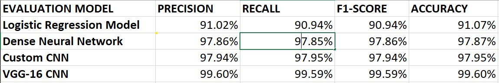

# Digit recognition using LRM, DNN and CNNs

A Logistic Regression Model, Dense Neural Network, Convolutional Neural Network and VGG-16 were used to classify the MNIST handwritten digits dataset and the performance of each model is compared.

The LRM and DNN are implemented by us (from scratch, using numpy) and the custom CNN and VGG-16 are implemented using tensorflow and keras

Along with this, we have tested the VGG-16 model (which got the highest accuracies across the training and test sets) on a set of real-life images to see how well it can be applied as a character recognition model.

The respective model's .ipynb file has been uploaded as well along with their respective weights (the loading of the weights is shown in the notebooks as well)

The dataset can be found in kaggle websites, MNIST's own website and from keras as well

Here are the final results (average values):

